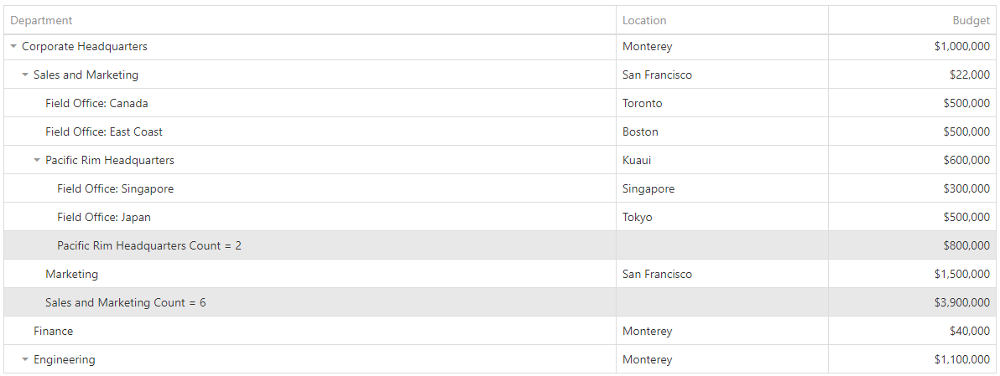

<!-- default badges list -->

<!-- default badges end -->

# TreeList for DevExtreme - How to display a summary for each level

This example illustrates how to display a summary (e.g. count|sum) for each level in TreeList.

The calculation starts when the data was initially loaded in the [onContentReady](https://js.devexpress.com/Documentation/ApiReference/UI_Components/dxTreeList/Configuration/#onContentReady) event handler.  Summmary calculation is implemented in the `getSummary` function. In this function we use recursion in order to traverse all nodes and get the necessary data to calculate the total value for each level.

After calculation is finished, the [push](https://js.devexpress.com/Documentation/ApiReference/Data_Layer/ArrayStore/Methods/#pushchanges) API is used in order to insert rows with summary values on each level.

Note that this solution does not support remote operations.

## Files to Review

- **Angular**
    - [app.component.html](Angular/src/app/app.component.html)
    - [app.component.ts](Angular/src/app/app.component.ts)
- **jQuery**
    - [index.html](jQuery/src/index.html)
    - [index.js](jQuery/src/index.js)
- **React**
    - [App.js](React/src/App.js)
- **Vue**
    - [App.vue](Vue/src/App.vue)

## Documentation

- [Getting Started with TreeList](https://js.devexpress.com/Documentation/Guide/UI_Components/TreeList/Getting_Started_with_TreeList/)

- [TreeList - API Reference](https://js.devexpress.com/Documentation/ApiReference/UI_Components/dxTreeList/)
