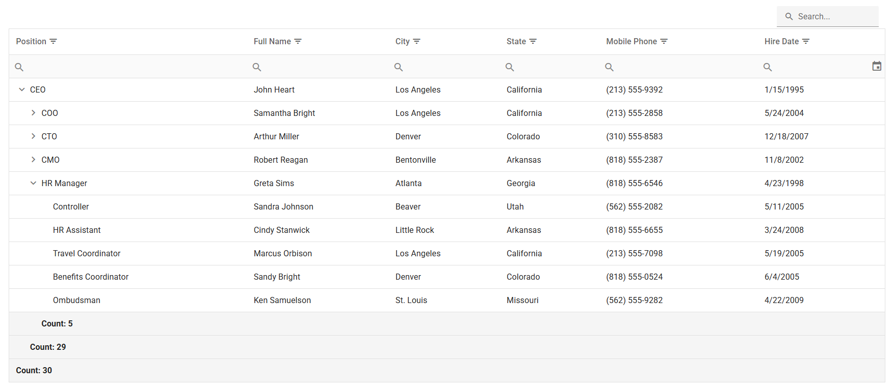

<!-- default badges list -->

[](https://supportcenter.devexpress.com/ticket/details/T988572)
[](https://docs.devexpress.com/GeneralInformation/403183)
[](#does-this-example-address-your-development-requirementsobjectives)
<!-- default badges end -->
# DevExtreme TreeList - Display a Summary for Each Node Branch

This example displays custom summary rows for each node branch in the DevExtreme [TreeList](https://js.devexpress.com/Documentation/Guide/UI_Components/TreeList/Overview/) hierarchy. These rows display the number of descendant nodes (first-level and indirect child nodes) for individual branches.



## Implementation Details

This example configures [onNodesInitialized](https://js.devexpress.com/Documentation/ApiReference/UI_Components/dxTreeList/Configuration/#onNodesInitialized) to loop through all TreeList nodes in a recursive function. This function calculates the number of visible descendants for each node branch in the component and appends custom summary nodes to these branches:

```JavaScript
function buildSummaries(node) {
    const children = node.children || [];
    let count = 0;

    for (const child of children) {
        if (child.isSummary) continue;
        const childDescendants = buildSummaries(child);
        count += (child.visible ? 1 : 0) + childDescendants;
    }

    if (count > 0) {
        node.children.push(createSummaryNode(node, count));
    }

    return count;
}
```

The following function configures the custom summary nodes:

```JavaScript
function createSummaryNode(node, count) {
    return {
        key: `summary_${node.key}`,
        parent: node.parent,
        isSummary: true,
        data: {
            Title: `Count: ${count}`,
        },
        children: [],
        visible: true,
    };
}
```

To apply styles to summary rows, define a custom `isSummary` option in appended [node objects](https://js.devexpress.com/Documentation/ApiReference/UI_Components/dxTreeList/Node/). The  [onRowPrepared](https://js.devexpress.com/Documentation/ApiReference/UI_Components/dxTreeList/Configuration/#onRowPrepared) event handler uses this custom option to add a `summary-row` class to summary nodes:

```JavaScript
onRowPrepared(e) {
    if (e.rowType === 'data' && e.node?.isSummary) {
        e.rowElement.addClass('summary-row');
    }
},
```

> [!Note]
> - This implementation does not support selection and remote operations.
> - This approach does not modify or require modifications to the TreeList data source.

## Files to Review

- **Angular**
    - [app.component.html](Angular/src/app/app.component.html)
    - [app.component.ts](Angular/src/app/app.component.ts)
- **React**
    - [App.tsx](React/src/App.tsx)
- **Vue**
    - [HomeContent.vue](Vue/src/components/HomeContent.vue)
- **jQuery**
    - [index.html](jQuery/src/index.html)
    - [index.js](jQuery/src/index.js)
- **ASP.NET Core**    
    - [Index.cshtml](ASP.NET%20Core/Views/Home/Index.cshtml)

## Documentation

- [Getting Started with TreeList](https://js.devexpress.com/Documentation/Guide/UI_Components/TreeList/Getting_Started_with_TreeList/)
- [TreeList API - onNodesInitialized](https://js.devexpress.com/jQuery/Documentation/ApiReference/UI_Components/dxTreeList/Configuration/#onNodesInitialized)
<!-- feedback -->
## Does This Example Address Your Development Requirements/Objectives?

[](https://www.devexpress.com/support/examples/survey.xml?utm_source=github&utm_campaign=devextreme-treelist-display-summary-for-each-level&~~~was_helpful=yes) [](https://www.devexpress.com/support/examples/survey.xml?utm_source=github&utm_campaign=devextreme-treelist-display-summary-for-each-level&~~~was_helpful=no)

(you will be redirected to DevExpress.com to submit your response)
<!-- feedback end -->
